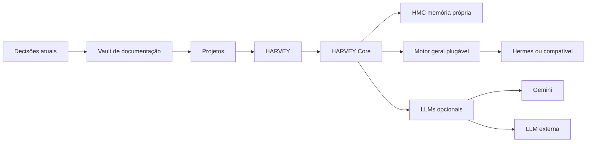

# Contexto mestre consolidado

Cobertura parcial e rastreável: arquivos existentes no Vault e inventário local do Codex.

## Regras globais verificadas

HARVEY é a interface/identidade e seu Core é independente.
HMC é a memória operacional própria, separada da documentação Obsidian.
Motor geral escolhido pelo usuário: Hermes, Codex, Claude Code ou compatível.
Gemini/Jev/LLM externa não são cérebro nem dependência universal.
LLMs adicionais são somente para respostas sem ferramentas do computador.
No instalador Windows desejado: voz Windows TTS padrão; Whisper STT e
Pocket TTS instalados; Pocket alternativo; outros modelos opcionais.
O estado desejado do instalador não é prova de execução.
Ações com PC/arquivos/contas requerem Permission Engine.
Sem commit, push, deploy, limpeza destrutiva ou instalação sem autorização.

## Fontes decisórias atuais

- [[../47-Decisao-Oficial-Motores-LLMs-e-Audio-20260924]]
- [[../46-Arquitetura-Motor-Plugavel-20260923]]
- [[../43-HMC-Estado-Atual-20260922]]
- [[../02-Arquitetura]]
- [[../08-Decisoes-e-Pendencias]]

## Estado técnico documentado em 24/09/2026

HARVEY web/Vite: 1420; Voice/API: 8765; Core/HMC: 8766;
orquestrador de áudio: 8770, todos em loopback no último teste.
Hermes nas portas futuras 8645/9119: não instalado/ativo no checkpoint.
Roteamento auxiliar: Gemini opcional e LLM compatível OpenAI configurável.
A API externa de VM/Cloudflare listou modelo mas falhou na geração
em 15s e 35s e depois no DNS, portanto NÃO foi ativada.
Gemini e Jev sem credenciais no último checkpoint registrado.
66 testes focados aprovados, build web PASS; binário Tauri antigo.
Fonte: H.A.R.V.E.Y/docs/HARVEY-PROVEDORES-CONVERSA-20260924.md.

## HMC, Kanban, agentes e interfaces

HMC M0 estabilizado; M1 com persistência/governança; M2 com FTS5,
API e Context Pack testados localmente; M3+ (MCP, multi-host,
pgvector/embeddings e sync Vault governado) continuam planejados.
O Vault é documental e pode complementar a HMC por leitura controlada,
nunca substituir sua governança nem injetar todos os arquivos a cada turno.
HARVEY pode ter desktop/voz, web/PWA e terminal próprio.
Agent Operations Graph é workspace adicional; Harvey Orb é a presença
visual e Harvey Core é nó lógico no grafo; não duplicar agentes/processos.
Kanban deve ter fonte única por projeto, com autoridade clara do motor
selecionado, ações de risco autorizadas e histórico/auditoria.
A documentação antiga com Hermes obrigatório é superada pela
arquitetura de motor geral plugável de 23–24/09/2026.

## Limites desta consolidação

É índice baseado nos documentos realmente disponíveis, não uma
análise já concluída de todas as 184 sessões locais do Codex.
Não contém exportação integral da conta ChatGPT nem anexos originais.
Não presumir que resumos antigos comprovam o estado técnico atual.

## Outros projetos: entrada em até 1 leitura

### GestoraX

Web/PWA de gestão. Preferência React, TypeScript, Vite,
Tailwind CSS, React Router; trabalho via VS Code e GitHub.
Índice de chats antigos cita Sprint 7, motor de produção v3 isolado,
tela `producao.tsx` ainda no fluxo antigo e risco de validação de backup
em agosto de 2026. **Não tratar como diagnóstico atual.**
Fonte: [[Projetos/GestoraX/README]] e índice ChatGPT de 23/08.

### MinhaRota-PRO

App de finanças para entregadores: turnos, ganhos, despesas,
contas, dívidas, caixinhas/metas, gráficos e Horários de Ouro.
Protótipo web local v0.8.0-beta em HTML, localStorage/IndexedDB
e ambição PWA. Pedido pendente: configurações em painel sobreposto
e tema claro cinza. Android/Firebase é trilha separada e requer
revisar App Check e regras antes de publicar.
Fonte: [[Projetos/MinhaRota-PRO/00-Resumo-e-PRD]] e
[[Projetos/MinhaRota-PRO/01-Status-e-Checklist]] (22/08/2026).

### WMMusicaPage | Wilma Machado

Landing page editorial para cantora/compositora: trajetória,
músicas, obras, vídeos, licenciamento e contatos oficiais;
responsiva, multilíngue, visual calmo/elegante.
Fonte do frontend documentada em `public/code.html`; publicação
GitHub/Cloudflare requer reconferir deploy, links e domínio.
Fonte: [[Projetos/WMMusicaPage/00-Resumo-e-PRD]] e
[[Projetos/WMMusicaPage/01-Status-e-Checklist]] (21/08/2026).

### ShopeeAutoVendas

App Flask/Python com Supabase Postgres e deploy Render Free
documentado em 27/08/2026. Senha administrativa, rate limit,
criptografia, testes críticos, garimpo Shopee e Copywriter IA
constavam como implementados no índice daquele dia.
Pendências de agosto: Threads OAuth e publicação real,
integrações de outras redes sociais e scheduler no Render.
Revalidar estado do deploy e do Supabase antes de agir.
Fonte: [[Projetos/ShopeeAutoVendas/00-INDICE-Estado-Atual]].

### MiauDelier Manager

PWA local-first e single-user para produção de peças de resina:
estoque, moldes, volume/proporções, precificação e financeiro.
Gemini é opcional para dicas. PRD não prova app concluído.
Fonte: [[Projetos/MiauDelier Manager/00-Resumo-e-PRD]].

### Outros projetos preservados no Vault

Raffa Studio Landing Page: documentação própria em
`Projetos/Raffa-Studio-Landing-Page`.
Sigma Aura Simulator e Nana-Kimura: estrutura inicial,
escopo e status ainda requerem confirmação.
MiauDelier, MinhaRota, GestoraX, Shopee e WMMusicaPage
possuem documentação separada com datas próprias.

### Ferramentas e preferências transversais

Skills antigas citadas: Graphify, agent-browser, Strix,
vibe-coding-toolkit, run-controlled-agent-loop e outras.
Não assumir presença ou versões atuais sem verificar.
Não misturar memória HARVEY com Vault documental;
consultar trechos específicos em vez de ler tudo.
Segurança prioritária: TLS, autorização, segredos fora
do Git, logs sanitizados, aprovação antes de ações críticas.
Não executar commit, push ou publicação sem pedido explícito.

## Grafo resumido

Relações documentais; não implicam que o motor esteja instalado.
Este grafo utiliza Mermaid, nativo do Obsidian.

