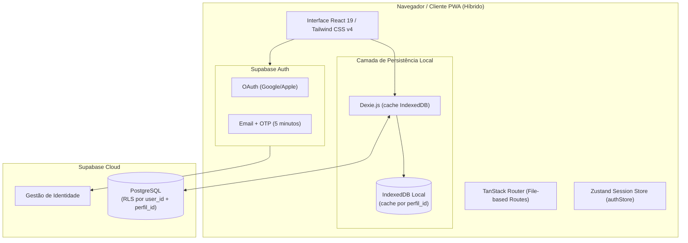

# Arquitetura do Sistema

Este documento descreve a estrutura técnica, os componentes de software, o modelo de dados local-first e os padrões arquiteturais adotados no **MiauDelier Manager**. Estado confirmado em 08/10/2026.

---

## 1. Arquitetura de Alto Nível
O **MiauDelier Manager** usa uma arquitetura **híbrida (cache local + sincronização em nuvem)**. Dexie/IndexedDB mantém a cópia local para resposta rápida e uso offline; o Supabase fornece identidade, RLS, banco remoto, Edge Functions e transporte HTTPS. Dados de negócio não passam por cifra interna no cliente: o frontend usa somente as chaves públicas de comunicação do Supabase.



### Fluxo de Autenticação, Dados e IA

1. **Autenticação de identidade:** o usuário entra por e-mail/senha confirmado, Google ou Apple. O Supabase Auth emite a sessão e o RLS impõe `auth.uid()` nas operações remotas.
2. **Vínculo de provedores:** uma identidade Google ou Apple pode ser vinculada à conta autenticada quando o projeto Supabase habilita *manual linking*. Depois do vínculo, o login deve usar o provedor correspondente; o formulário não induz a um novo cadastro.
3. **Sincronização:** alterações do Dexie entram no Ledger local e são enviadas como eventos JSON autorizados. Ao entrar, reconectar ou voltar ao foco, o cliente baixa eventos autorizados e os aplica no cache.
4. **Gemini:** cada usuária envia sua própria chave apenas para uma Edge Function autenticada. Ela é guardada no Vault do Supabase vinculada ao `user.id`, fica fora do navegador e é a única usada pelo servidor para chamar Gemini. Não há fallback de chave compartilhada. O dashboard fornece ao modelo apenas indicadores pertinentes do ateliê, sem fabricar tendências de mercado.

---

## 2. Pilha de Tecnologia

| Camada | Tecnologia | Função / Responsabilidade |
| --- | --- | --- |
| **Linguagem** | TypeScript 5.8 | Tipagem estática rigorosa em todo o projeto |
| **Frontend Framework** | React 19.2 | Biblioteca de interface do usuário declarativa (SPA) |
| **Roteamento** | TanStack Router v1 | Roteamento baseado em arquivos tipado estaticamente (`src/routes`) |
| **Build & Bundler** | Vite 8.2 | Servidor de dev e empacotamento de produção com Rolldown/ESBuild |
| **Testes** | Vitest 3 + Testing Library | Execução de suítes de testes unitários e de integração de componentes |
| **Banco de Dados** | Dexie.js 4.4 + IndexedDB | Banco de dados NoSQL indexado local no navegador |
| **Sincronização & Nuvem (Fase 7)** | Supabase (PostgreSQL) | Banco de dados na nuvem para backup e sincronização |
| **Gerenciamento de Estado** | Zustand 5.0 | Estado global reativo de autenticação e sessão do usuário |
| **Segurança de acesso** | Supabase Auth + RLS + HTTPS | Identidade, autorização por usuário/perfil e transporte seguro |
| **Autenticação (Fase 7)** | Supabase Auth | Login Social (Google, Apple) e Email/Senha |
| **Estilização** | Tailwind CSS v4 | Framework CSS utilitário para design system customizado em Dark Mode |
| **Validação** | Zod | Schemas de validação de formulários e parsing |
| **PWA / Service Worker** | Vite PWA Plugin | Suporte a PWA instalável offline e manifesto da aplicação |

---

## 3. Estrutura de Pastas

```text
MiauDelier-Manager/
├── docs/                               # Documentação operacional viva do projeto
│   ├── PRD.md                          # Requisitos do produto e escopo MVP
│   ├── ARCHITECTURE.md                 # Estrutura técnica e arquitetura (este arquivo)
│   ├── RULES.md                        # Diretrizes e convenções de código
│   ├── DESIGN.md                       # Design System e componentes visuais
│   ├── TASK.md                         # Plano de tarefas divididas por fases
│   └── MEMORY.md                       # Memória viva do estado do projeto
├── public/                             # Ativos estáticos e manifestos PWA
├── src/
│   ├── assets/                         # Imagens e logotipos do produto
│   ├── components/
│   │   ├── layout/                     # AppShell, barras de navegação e layouts
│   │   └── ui/                         # Componentes reutilizáveis do Design System
│   │       ├── Badge.tsx
│   │       ├── Button.tsx
│   │       ├── Card.tsx
│   │       ├── ConfirmModal.tsx
│   │       ├── EmptyState.tsx
│   │       ├── SeletorImagem.tsx       # Componente de foto via câmera/galeria
│   │       ├── Tabs.tsx
│   │       ├── TextField.tsx
│   │       ├── ToastProvider.tsx
│   │       └── ...
│   ├── db/
│   │   ├── schema.ts                   # Schema Dexie.js e interfaces TypeScript
│   │   └── schema.test.ts              # Testes de regressão e migração de banco
│   ├── features/                       # Módulos funcionais da aplicação
│   │   ├── agenda/                     # Agendamento e compromissos
│   │   ├── analytics/                  # Indicadores gráficos e estatísticas
│   │   ├── assistente/                 # Chat com assistente de IA Gemini
│   │   ├── auditoria/                  # Registro de auditoria imutável
│   │   ├── auth/                       # Formulário de login e guardas de rota
│   │   ├── calculator/                 # Motor de cálculo de volume e proporções
│   │   ├── configuracoes/              # Backup, exportação e restore
│   │   ├── dashboard/                  # Dashboard principal com resumo IA
│   │   ├── financeiro/                 # Contas bancárias e transações
│   │   ├── ia/                         # Cliente Gemini e rate-limiting
│   │   ├── mais/                       # Menu secundário e utilitários
│   │   ├── pricing/                    # Tarifas elétricas e custos de equipamentos
│   │   ├── producao/                   # Materiais, Formas, Peças e Vitrine WhatsApp
│   │   └── vendas/                     # Gestão de Clientes e Pedidos
│   ├── lib/                            # Bibliotecas utilitárias e conectores
│   │   ├── auth.ts                     # Autenticação e bloqueio temporário
│   │   ├── backup.ts                   # Geração e importação de backup com SHA-256
│   │   ├── perfisRepo.ts               # Gestão de múltiplos perfis isolados
│   │   ├── unidades.ts                 # Utilitário de conversão de unidades de medida
│   │   └── ...
│   ├── routes/                         # Roteamento baseado em arquivos (TanStack Router)
│   │   ├── __root.tsx                  # Layout raiz com AppShell
│   │   ├── index.tsx                   # Rota inicial do Dashboard
│   │   ├── formas.tsx                  # Rota de Moldes/Formas
│   │   ├── pecas.tsx                   # Rota de Peças & Vitrine
│   │   ├── materiais.tsx               # Rota de Estoque de Materiais
│   │   ├── pedidos.tsx                 # Rota de Pedidos
│   │   └── ...
│   ├── stores/                         # Zustand Stores
│   │   └── authStore.ts                # Estado global de sessão Supabase
│   ├── styles/                         # Estilos globais e tokens CSS Tailwind
│   ├── routeTree.gen.ts                # Árvore de rotas gerada pelo TanStack Router
│   ├── router.tsx                      # Instância do roteador TanStack
│   └── main.tsx / entry-client.tsx     # Ponto de entrada React SPA
├── index.html                          # HTML raiz da aplicação SPA
├── package.json                        # Dependências e scripts de execução
├── tsconfig.json                       # Configurações TypeScript
├── vite.config.ts                      # Configuração do Vite e PWA
└── vitest.config.ts                    # Configuração de testes Vitest
```

---

## 4. Schemas do Banco de Dados IndexedDB (Dexie.js)

O banco de dados local utiliza as seguintes tabelas indexadas no IndexedDB (`src/db/schema.ts`):

- **`categoriasMaterial`**: `++id, nome, categoriaPaiId`
- **`materiais`**: `++id, nome, categoriaId, subcategoriaId`
- **`formas`**: `++id, nome, geometria` (armazena também `imagemUrl` base64)
- **`pecas`**: `++id, nome, formaId, status` (armazena `numeroSerie` `#0001` e `imagemUrl` base64)
- **`consumosPeca`**: `++id, pecaId, materialId`
- **`eventosPeca`**: `++id, pecaId, tipo, criadoEm`
- **`clientes`**: `++id, nome`
- **`pedidos`**: `++id, clienteId, status, *pecaIds`
- **`transacoes`**: `++id, contaId, tipo, data`
- **`contas`**: `++id, nome`
- **`configuracoes`**: `++id, &chave` (chaves de preferências, como `loja.whatsapp`)
- **`auditoria`**: `++id, entidade, entidadeId, quando`
- **`backups`**: `++id, criadoEm`
- **`mensagensIA`**: `++id, criadoEm`
- **`notificacoes`**: `++id, lida, criadoEm`
- **`equipamentos`**: `++id, nome`
- **`taxas`**: `++id, nome`
