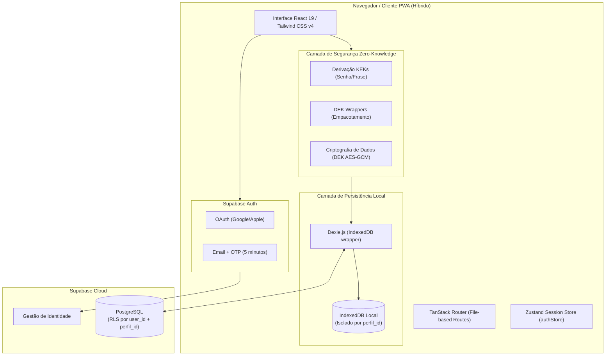

# Arquitetura do Sistema

Este documento descreve a estrutura técnica, os componentes de software, o modelo de dados local-first e os padrões arquiteturais adotados no **MiauDelier Manager**.

---

## 1. Arquitetura de Alto Nível
O **MiauDelier Manager** é construído sob uma arquitetura **Híbrida (Local-First + Cloud Sync)**. As operações de leitura e escrita locais são otimizadas via **IndexedDB/Dexie.js**. A sincronização em nuvem e a identidade do usuário são gerenciadas pelo **Supabase (PostgreSQL + Auth)**, enquanto a criptografia E2EE (Zero-Knowledge) é mantida ativamente local.



### Fluxo de Autenticação e Dados Cifrados (Login de 2 Passos)

1. **Autenticação de Identidade (Supabase):** O usuário efetua login com Google, Apple, ou Email + OTP (5 min). O Supabase valida a identidade e emite um JWT de sessão. Isso garante acesso à sincronização e respeita o RLS (`auth.uid() = user_id`).
2. **Desbloqueio e Recuperação do Cofre (DEK/KEK):** Mesmo logado com a nuvem, o usuário **deve** informar a sua **Senha do Cofre** localmente para acessar dados cifrados. O sistema utiliza a senha para derivar uma KEK (Key Encryption Key) via PBKDF2 (600.000 iterações), que por sua vez desempacota a DEK (Data Encryption Key) mestre salva localmente. Caso o usuário perca a senha, ele aciona o recurso "Esqueci minha senha", onde uma **autenticação dupla** é exigida: após reverificar sua identidade provando acesso ao E-mail cadastrado (OTP no Supabase Auth), o sistema faz o download de uma versão de recuperação da DEK previamente empacotada na nuvem. O aplicativo, então, deriva uma KEK de Recuperação (usando o `user_id` do Supabase e um pepper local da aplicação) para desempacotar a DEK, restabelecer a sessão e permitir a criação de uma nova Senha do Cofre.
3. **Múltiplos Perfis (10 perfis/conta):** Um único `user_id` pode possuir até 10 perfis isolados. Cada registro possui um `perfil_id`. Na nuvem, o RLS permite que o usuário gerencie seus perfis, e localmente o Dexie isola o roteamento de dados por perfil. O recurso de **Mesclar Conta** (para migrar de um perfil puramente local/senha para uma conta Google) é feito de forma segura mediante confirmação com a Senha do Cofre, estando obrigatoriamente logado na tela de gestão de Perfis.
4. **Escrita/Leitura Cifrada**: Dados financeiros passam pelo helper `cifrarCampo()`/`decifrarCampo()` usando a chave em memória. O banco remoto armazena apenas as strings base64 do payload cifrado.na-se ilegível para os campos protegidos.

---

## 2. Pilha de Tecnologia

| Camada | Tecnologia | Função / Responsabilidade |
| --- | --- | --- |
| **Linguagem** | TypeScript 5.8 | Tipagem estática rigorosa em todo o projeto |
| **Frontend Framework** | React 19.2 | Biblioteca de interface do usuário declarativa (SPA) |
| **Roteamento** | TanStack Router v1 | Roteamento baseado em arquivos tipado estaticamente (`src/routes`) |
| **Build & Bundler** | Vite 8.2 | Servidor de dev e empacotamento de produção com Rolldown/ESBuild |
| **Testes** | Vitest 3 + Testing Library | Execução de suítes de testes unitários e de integração de componentes |
| **Banco de Dados** | Dexie.js 4.4 + IndexedDB | Banco de dados NoSQL indexado local no navegador |
| **Sincronização & Nuvem (Fase 7)** | Supabase (PostgreSQL) | Banco de dados na nuvem para backup e sincronização |
| **Gerenciamento de Estado** | Zustand 5.0 | Estado global reativo de autenticação e sessão do usuário |
| **Segurança / Cifra** | WebCrypto API Nativa | Derivação de chave PBKDF2 e criptografia simétrica AES-GCM |
| **Autenticação (Fase 7)** | Supabase Auth | Login Social (Google, Apple) e Email/Senha |
| **Estilização** | Tailwind CSS v4 | Framework CSS utilitário para design system customizado em Dark Mode |
| **Validação** | Zod | Schemas de validação de formulários e parsing |
| **PWA / Service Worker** | Vite PWA Plugin | Suporte a PWA instalável offline e manifesto da aplicação |

---

## 3. Estrutura de Pastas

```text
MiauDelier-Manager/
├── docs/                               # Documentação operacional viva do projeto
│   ├── PRD.md                          # Requisitos do produto e escopo MVP
│   ├── ARCHITECTURE.md                 # Estrutura técnica e arquitetura (este arquivo)
│   ├── RULES.md                        # Diretrizes e convenções de código
│   ├── DESIGN.md                       # Design System e componentes visuais
│   ├── TASK.md                         # Plano de tarefas divididas por fases
│   └── MEMORY.md                       # Memória viva do estado do projeto
├── public/                             # Ativos estáticos e manifestos PWA
├── src/
│   ├── assets/                         # Imagens e logotipos do produto
│   ├── components/
│   │   ├── layout/                     # AppShell, barras de navegação e layouts
│   │   └── ui/                         # Componentes reutilizáveis do Design System
│   │       ├── Badge.tsx
│   │       ├── Button.tsx
│   │       ├── Card.tsx
│   │       ├── ConfirmModal.tsx
│   │       ├── EmptyState.tsx
│   │       ├── SeletorImagem.tsx       # Componente de foto via câmera/galeria
│   │       ├── Tabs.tsx
│   │       ├── TextField.tsx
│   │       ├── ToastProvider.tsx
│   │       └── ...
│   ├── db/
│   │   ├── schema.ts                   # Schema Dexie.js e interfaces TypeScript
│   │   └── schema.test.ts              # Testes de regressão e migração de banco
│   ├── features/                       # Módulos funcionais da aplicação
│   │   ├── agenda/                     # Agendamento e compromissos
│   │   ├── analytics/                  # Indicadores gráficos e estatísticas
│   │   ├── assistente/                 # Chat com assistente de IA Gemini
│   │   ├── auditoria/                  # Registro de auditoria imutável
│   │   ├── auth/                       # Formulário de login e guardas de rota
│   │   ├── calculator/                 # Motor de cálculo de volume e proporções
│   │   ├── configuracoes/              # Backup, exportação e restore
│   │   ├── dashboard/                  # Dashboard principal com resumo IA
│   │   ├── financeiro/                 # Contas bancárias e transações cifradas
│   │   ├── ia/                         # Cliente Gemini e rate-limiting
│   │   ├── mais/                       # Menu secundário e utilitários
│   │   ├── pricing/                    # Tarifas elétricas e custos de equipamentos
│   │   ├── producao/                   # Materiais, Formas, Peças e Vitrine WhatsApp
│   │   └── vendas/                     # Gestão de Clientes e Pedidos
│   ├── lib/                            # Bibliotecas utilitárias e conectores
│   │   ├── auth.ts                     # Autenticação e bloqueio temporário
│   │   ├── backup.ts                   # Geração e importação de backup com SHA-256
│   │   ├── camposCifrados.ts           # Interceptador de criptografia WebCrypto
│   │   ├── crypto.ts                   # Primitivas de cifra AES-GCM/PBKDF2
│   │   ├── perfisRepo.ts               # Gestão de múltiplos perfis isolados
│   │   ├── unidades.ts                 # Utilitário de conversão de unidades de medida
│   │   └── ...
│   ├── routes/                         # Roteamento baseado em arquivos (TanStack Router)
│   │   ├── __root.tsx                  # Layout raiz com AppShell
│   │   ├── index.tsx                   # Rota inicial do Dashboard
│   │   ├── formas.tsx                  # Rota de Moldes/Formas
│   │   ├── pecas.tsx                   # Rota de Peças & Vitrine
│   │   ├── materiais.tsx               # Rota de Estoque de Materiais
│   │   ├── pedidos.tsx                 # Rota de Pedidos
│   │   └── ...
│   ├── stores/                         # Zustand Stores
│   │   └── authStore.ts                # Estado global de sessão e chave de cifra
│   ├── styles/                         # Estilos globais e tokens CSS Tailwind
│   ├── routeTree.gen.ts                # Árvore de rotas gerada pelo TanStack Router
│   ├── router.tsx                      # Instância do roteador TanStack
│   └── main.tsx / entry-client.tsx     # Ponto de entrada React SPA
├── index.html                          # HTML raiz da aplicação SPA
├── package.json                        # Dependências e scripts de execução
├── tsconfig.json                       # Configurações TypeScript
├── vite.config.ts                      # Configuração do Vite e PWA
└── vitest.config.ts                    # Configuração de testes Vitest
```

---

## 4. Schemas do Banco de Dados IndexedDB (Dexie.js)

O banco de dados local utiliza as seguintes tabelas indexadas no IndexedDB (`src/db/schema.ts`):

- **`categoriasMaterial`**: `++id, nome, categoriaPaiId`
- **`materiais`**: `++id, nome, categoriaId, subcategoriaId`
- **`formas`**: `++id, nome, geometria` (armazena também `imagemUrl` base64)
- **`pecas`**: `++id, nome, formaId, status` (armazena `numeroSerie` `#0001` e `imagemUrl` base64)
- **`consumosPeca`**: `++id, pecaId, materialId`
- **`eventosPeca`**: `++id, pecaId, tipo, criadoEm`
- **`clientes`**: `++id, nome`
- **`pedidos`**: `++id, clienteId, status, *pecaIds`
- **`transacoes`**: `++id, contaId, tipo, data` (possuem campo `valorCriptografado`)
- **`contas`**: `++id, nome` (possuem campo `saldoCriptografado`)
- **`configuracoes`**: `++id, &chave` (chaves únicas como `ia.chaveGemini`, `loja.whatsapp`)
- **`auditoria`**: `++id, entidade, entidadeId, quando`
- **`backups`**: `++id, criadoEm`
- **`mensagensIA`**: `++id, criadoEm`
- **`notificacoes`**: `++id, lida, criadoEm`
- **`equipamentos`**: `++id, nome`
- **`taxas`**: `++id, nome`
