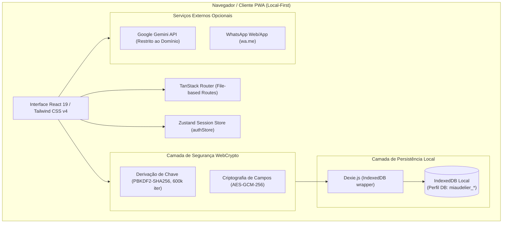

# Arquitetura do Sistema

Este documento descreve a estrutura técnica, os componentes de software, o modelo de dados local-first e os padrões arquiteturais adotados no **MiauDelier Manager**.

---

## 1. Arquitetura de Alto Nível

O **MiauDelier Manager** é construído sob uma arquitetura **Local-First SPA (Single-Page Application)**. Não existe backend próprio de aplicação, banco de dados remoto centralizado ou servidor de sessão na versão inicial. Todas as operações de leitura, escrita, cálculo e relatórios ocorrem diretamente no navegador do usuário utilizando **IndexedDB** gerenciado pelo **Dexie.js**. A partir da **Fase 7**, a arquitetura evoluirá para um modelo **Híbrido**, utilizando o **Supabase (PostgreSQL + Auth)** para sincronização em nuvem e login multiplataforma (Google, Email, Apple).



### Fluxo de Dados Cifrados

1. **Login e Derivação**: Quando a usuária efetua login com a senha, o WebCrypto deriva uma chave simétrica AES-GCM em memória usando PBKDF2 com 600.000 iterações. A senha em texto claro e a chave derivada **nunca** são salvas no disco.
2. **Escrita Cifrada**: Operações financeiras (saldos de contas e valores de transações) passam obrigatoriamente pelo helper `cifrarCampo()` em `src/lib/camposCifrados.ts`. O valor em texto claro é convertido em payload cifrado Base64 antes de ser gravado no IndexedDB.
3. **Leitura Cifrada**: Na leitura, `decifrarCampo()` decodifica o payload usando a chave mantida na sessão reativa do Zustand. Se a sessão for encerrada, o banco torna-se ilegível para os campos protegidos.

---

## 2. Pilha de Tecnologia

| Camada | Tecnologia | Função / Responsabilidade |
| --- | --- | --- |
| **Linguagem** | TypeScript 5.8 | Tipagem estática rigorosa em todo o projeto |
| **Frontend Framework** | React 19.2 | Biblioteca de interface do usuário declarativa (SPA) |
| **Roteamento** | TanStack Router v1 | Roteamento baseado em arquivos tipado estaticamente (`src/routes`) |
| **Build & Bundler** | Vite 8.2 | Servidor de dev e empacotamento de produção com Rolldown/ESBuild |
| **Testes** | Vitest 3 + Testing Library | Execução de suítes de testes unitários e de integração de componentes |
| **Banco de Dados** | Dexie.js 4.4 + IndexedDB | Banco de dados NoSQL indexado local no navegador |
| **Sincronização & Nuvem (Fase 7)** | Supabase (PostgreSQL) | Banco de dados na nuvem para backup e sincronização |
| **Gerenciamento de Estado** | Zustand 5.0 | Estado global reativo de autenticação e sessão do usuário |
| **Segurança / Cifra** | WebCrypto API Nativa | Derivação de chave PBKDF2 e criptografia simétrica AES-GCM |
| **Autenticação (Fase 7)** | Supabase Auth | Login Social (Google, Apple) e Email/Senha |
| **Estilização** | Tailwind CSS v4 | Framework CSS utilitário para design system customizado em Dark Mode |
| **Validação** | Zod | Schemas de validação de formulários e parsing |
| **PWA / Service Worker** | Vite PWA Plugin | Suporte a PWA instalável offline e manifesto da aplicação |

---

## 3. Estrutura de Pastas

```text
MiauDelier-Manager/
├── docs/                               # Documentação operacional viva do projeto
│   ├── PRD.md                          # Requisitos do produto e escopo MVP
│   ├── ARCHITECTURE.md                 # Estrutura técnica e arquitetura (este arquivo)
│   ├── RULES.md                        # Diretrizes e convenções de código
│   ├── DESIGN.md                       # Design System e componentes visuais
│   ├── TASK.md                         # Plano de tarefas divididas por fases
│   └── MEMORY.md                       # Memória viva do estado do projeto
├── public/                             # Ativos estáticos e manifestos PWA
├── src/
│   ├── assets/                         # Imagens e logotipos do produto
│   ├── components/
│   │   ├── layout/                     # AppShell, barras de navegação e layouts
│   │   └── ui/                         # Componentes reutilizáveis do Design System
│   │       ├── Badge.tsx
│   │       ├── Button.tsx
│   │       ├── Card.tsx
│   │       ├── ConfirmModal.tsx
│   │       ├── EmptyState.tsx
│   │       ├── SeletorImagem.tsx       # Componente de foto via câmera/galeria
│   │       ├── Tabs.tsx
│   │       ├── TextField.tsx
│   │       ├── ToastProvider.tsx
│   │       └── ...
│   ├── db/
│   │   ├── schema.ts                   # Schema Dexie.js e interfaces TypeScript
│   │   └── schema.test.ts              # Testes de regressão e migração de banco
│   ├── features/                       # Módulos funcionais da aplicação
│   │   ├── agenda/                     # Agendamento e compromissos
│   │   ├── analytics/                  # Indicadores gráficos e estatísticas
│   │   ├── assistente/                 # Chat com assistente de IA Gemini
│   │   ├── auditoria/                  # Registro de auditoria imutável
│   │   ├── auth/                       # Formulário de login e guardas de rota
│   │   ├── calculator/                 # Motor de cálculo de volume e proporções
│   │   ├── configuracoes/              # Backup, exportação e restore
│   │   ├── dashboard/                  # Dashboard principal com resumo IA
│   │   ├── financeiro/                 # Contas bancárias e transações cifradas
│   │   ├── ia/                         # Cliente Gemini e rate-limiting
│   │   ├── mais/                       # Menu secundário e utilitários
│   │   ├── pricing/                    # Tarifas elétricas e custos de equipamentos
│   │   ├── producao/                   # Materiais, Formas, Peças e Vitrine WhatsApp
│   │   └── vendas/                     # Gestão de Clientes e Pedidos
│   ├── lib/                            # Bibliotecas utilitárias e conectores
│   │   ├── auth.ts                     # Autenticação e bloqueio temporário
│   │   ├── backup.ts                   # Geração e importação de backup com SHA-256
│   │   ├── camposCifrados.ts           # Interceptador de criptografia WebCrypto
│   │   ├── crypto.ts                   # Primitivas de cifra AES-GCM/PBKDF2
│   │   ├── perfisRepo.ts               # Gestão de múltiplos perfis isolados
│   │   ├── unidades.ts                 # Utilitário de conversão de unidades de medida
│   │   └── ...
│   ├── routes/                         # Roteamento baseado em arquivos (TanStack Router)
│   │   ├── __root.tsx                  # Layout raiz com AppShell
│   │   ├── index.tsx                   # Rota inicial do Dashboard
│   │   ├── formas.tsx                  # Rota de Moldes/Formas
│   │   ├── pecas.tsx                   # Rota de Peças & Vitrine
│   │   ├── materiais.tsx               # Rota de Estoque de Materiais
│   │   ├── pedidos.tsx                 # Rota de Pedidos
│   │   └── ...
│   ├── stores/                         # Zustand Stores
│   │   └── authStore.ts                # Estado global de sessão e chave de cifra
│   ├── styles/                         # Estilos globais e tokens CSS Tailwind
│   ├── routeTree.gen.ts                # Árvore de rotas gerada pelo TanStack Router
│   ├── router.tsx                      # Instância do roteador TanStack
│   └── main.tsx / entry-client.tsx     # Ponto de entrada React SPA
├── index.html                          # HTML raiz da aplicação SPA
├── package.json                        # Dependências e scripts de execução
├── tsconfig.json                       # Configurações TypeScript
├── vite.config.ts                      # Configuração do Vite e PWA
└── vitest.config.ts                    # Configuração de testes Vitest
```

---

## 4. Schemas do Banco de Dados IndexedDB (Dexie.js)

O banco de dados local utiliza as seguintes tabelas indexadas no IndexedDB (`src/db/schema.ts`):

- **`categoriasMaterial`**: `++id, nome, categoriaPaiId`
- **`materiais`**: `++id, nome, categoriaId, subcategoriaId`
- **`formas`**: `++id, nome, geometria` (armazena também `imagemUrl` base64)
- **`pecas`**: `++id, nome, formaId, status` (armazena `numeroSerie` `#0001` e `imagemUrl` base64)
- **`consumosPeca`**: `++id, pecaId, materialId`
- **`eventosPeca`**: `++id, pecaId, tipo, criadoEm`
- **`clientes`**: `++id, nome`
- **`pedidos`**: `++id, clienteId, status, *pecaIds`
- **`transacoes`**: `++id, contaId, tipo, data` (possuem campo `valorCriptografado`)
- **`contas`**: `++id, nome` (possuem campo `saldoCriptografado`)
- **`configuracoes`**: `++id, &chave` (chaves únicas como `ia.chaveGemini`, `loja.whatsapp`)
- **`auditoria`**: `++id, entidade, entidadeId, quando`
- **`backups`**: `++id, criadoEm`
- **`mensagensIA`**: `++id, criadoEm`
- **`notificacoes`**: `++id, lida, criadoEm`
- **`equipamentos`**: `++id, nome`
- **`taxas`**: `++id, nome`
